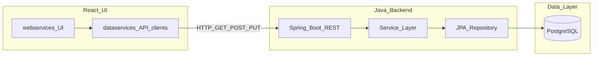
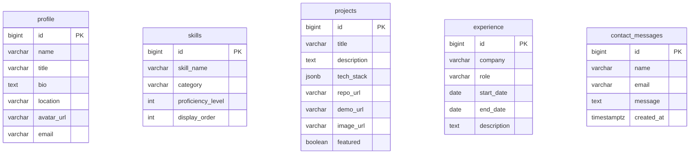
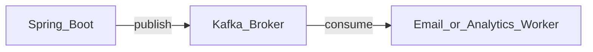
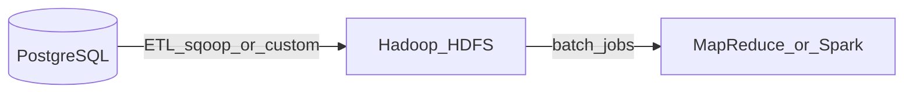

# Portfolio System Architecture

## 1. Overview and Principles

**Agenda:** Build the Vinay Moguloju portfolio as a full-stack application. React handles the user interface, Java (Spring Boot) exposes REST APIs and business logic, and PostgreSQL is the single source of truth for persistent data.

**Request flow:**

```
PostgreSQL → Spring Boot (REST) → React (dataservices → webservices)
```

- Data originates in PostgreSQL.
- The Java backend reads and writes via JPA repositories and serves JSON over HTTP.
- React **dataservices** call the backend; **webservices** render UI only and receive data via props.

**v1 scope:** PostgreSQL, Spring Boot 3, React (Vite + TypeScript), REST with **GET**, **POST**, and **PUT**.

**Phase 2+ (optional, not v1):** Apache Kafka for async events; Hadoop for batch analytics. See [Appendix: Kafka and Hadoop](#appendix-kafka-and-hadoop-phase-2).

### System context



---

## 2. Technology Stack

| Layer | Technology | Role |
|-------|------------|------|
| UI | React 18+ with Vite | Components, routing, styling |
| API client | Axios (or `fetch`) in **dataservices** | HTTP calls to backend only |
| API | Spring Boot 3 + Spring Web | REST controllers |
| ORM | Spring Data JPA + Hibernate | Entities and repositories |
| DB | PostgreSQL 16+ | Tables, constraints, indexes |
| Migrations | Flyway | Versioned SQL in `db/migration/` |
| Build (Java) | Maven 3.9+ | Backend module |
| Build (UI) | npm / pnpm + Vite | Frontend module |
| Optional (Phase 2+) | Apache Kafka, Hadoop (HDFS) | Eventing and batch analytics |

---

## 3. PostgreSQL Database

PostgreSQL is a dedicated layer. All tables live in database `portfolio_db` (configurable). Schema is applied via Flyway migrations on backend startup.

### 3.1 Conventions

- Primary keys: `BIGSERIAL` (auto-increment) unless noted.
- Every table includes `created_at` and `updated_at` (`TIMESTAMPTZ`, default `NOW()`).
- Public read data (profile, projects, skills, experience) is exposed via GET APIs.
- `contact_messages` is write-only from the public UI (POST); not listed via public GET in v1.

### 3.2 Entity relationship



Tables are logically independent in v1 (no foreign keys between portfolio content tables). `contact_messages` is isolated.

### 3.3 Table definitions

#### `profile`

Stores the public portfolio owner information (typically one row).

| Column | Type | Notes |
|--------|------|-------|
| `id` | BIGSERIAL PK | |
| `name` | VARCHAR(255) NOT NULL | |
| `title` | VARCHAR(255) | Job headline |
| `bio` | TEXT | |
| `location` | VARCHAR(255) | |
| `avatar_url` | VARCHAR(512) | |
| `email` | VARCHAR(255) | Public contact email |
| `created_at` | TIMESTAMPTZ | DEFAULT NOW() |
| `updated_at` | TIMESTAMPTZ | DEFAULT NOW() |

#### `skills`

| Column | Type | Notes |
|--------|------|-------|
| `id` | BIGSERIAL PK | |
| `skill_name` | VARCHAR(128) NOT NULL | |
| `category` | VARCHAR(64) | e.g. Frontend, Backend |
| `proficiency_level` | INT | 1–5 optional scale |
| `display_order` | INT DEFAULT 0 | Sort order in UI |
| `created_at` | TIMESTAMPTZ | |
| `updated_at` | TIMESTAMPTZ | |

**Index:** `idx_skills_display_order` on `(display_order)`.

#### `projects`

| Column | Type | Notes |
|--------|------|-------|
| `id` | BIGSERIAL PK | |
| `title` | VARCHAR(255) NOT NULL | |
| `description` | TEXT | |
| `tech_stack` | JSONB | e.g. `["React","Spring Boot"]` |
| `repo_url` | VARCHAR(512) | |
| `demo_url` | VARCHAR(512) | |
| `image_url` | VARCHAR(512) | |
| `featured` | BOOLEAN DEFAULT FALSE | |
| `created_at` | TIMESTAMPTZ | |
| `updated_at` | TIMESTAMPTZ | |

**Index:** `idx_projects_featured` on `(featured)`.

#### `experience`

| Column | Type | Notes |
|--------|------|-------|
| `id` | BIGSERIAL PK | |
| `company` | VARCHAR(255) NOT NULL | |
| `role` | VARCHAR(255) NOT NULL | |
| `start_date` | DATE | |
| `end_date` | DATE | NULL = present |
| `description` | TEXT | |
| `created_at` | TIMESTAMPTZ | |
| `updated_at` | TIMESTAMPTZ | |

#### `contact_messages`

Inbound messages from the contact form.

| Column | Type | Notes |
|--------|------|-------|
| `id` | BIGSERIAL PK | |
| `name` | VARCHAR(255) NOT NULL | |
| `email` | VARCHAR(255) NOT NULL | |
| `message` | TEXT NOT NULL | |
| `created_at` | TIMESTAMPTZ DEFAULT NOW() | |

### 3.4 Sample Flyway migration

File: `backend/src/main/resources/db/migration/V1__init.sql`

```sql
CREATE TABLE profile (
    id BIGSERIAL PRIMARY KEY,
    name VARCHAR(255) NOT NULL,
    title VARCHAR(255),
    bio TEXT,
    location VARCHAR(255),
    avatar_url VARCHAR(512),
    email VARCHAR(255),
    created_at TIMESTAMPTZ NOT NULL DEFAULT NOW(),
    updated_at TIMESTAMPTZ NOT NULL DEFAULT NOW()
);

CREATE TABLE skills (
    id BIGSERIAL PRIMARY KEY,
    skill_name VARCHAR(128) NOT NULL,
    category VARCHAR(64),
    proficiency_level INT,
    display_order INT NOT NULL DEFAULT 0,
    created_at TIMESTAMPTZ NOT NULL DEFAULT NOW(),
    updated_at TIMESTAMPTZ NOT NULL DEFAULT NOW()
);

CREATE INDEX idx_skills_display_order ON skills (display_order);

CREATE TABLE projects (
    id BIGSERIAL PRIMARY KEY,
    title VARCHAR(255) NOT NULL,
    description TEXT,
    tech_stack JSONB,
    repo_url VARCHAR(512),
    demo_url VARCHAR(512),
    image_url VARCHAR(512),
    featured BOOLEAN NOT NULL DEFAULT FALSE,
    created_at TIMESTAMPTZ NOT NULL DEFAULT NOW(),
    updated_at TIMESTAMPTZ NOT NULL DEFAULT NOW()
);

CREATE INDEX idx_projects_featured ON projects (featured);

CREATE TABLE experience (
    id BIGSERIAL PRIMARY KEY,
    company VARCHAR(255) NOT NULL,
    role VARCHAR(255) NOT NULL,
    start_date DATE,
    end_date DATE,
    description TEXT,
    created_at TIMESTAMPTZ NOT NULL DEFAULT NOW(),
    updated_at TIMESTAMPTZ NOT NULL DEFAULT NOW()
);

CREATE TABLE contact_messages (
    id BIGSERIAL PRIMARY KEY,
    name VARCHAR(255) NOT NULL,
    email VARCHAR(255) NOT NULL,
    message TEXT NOT NULL,
    created_at TIMESTAMPTZ NOT NULL DEFAULT NOW()
);
```

### 3.5 Local PostgreSQL setup

```bash
# macOS (Homebrew)
brew install postgresql@16
brew services start postgresql@16
createdb portfolio_db
psql portfolio_db -c "CREATE USER portfolio_user WITH PASSWORD 'your_password';"
psql portfolio_db -c "GRANT ALL PRIVILEGES ON DATABASE portfolio_db TO portfolio_user;"
```

Connection URL (backend):

```
jdbc:postgresql://localhost:5432/portfolio_db
```

---

## 4. Java Backend (Spring Boot)

### 4.1 Directory layout

```
backend/
  pom.xml
  src/main/java/com/portfolio/
    PortfolioApplication.java
    config/              # CORS, optional security
    controller/          # REST endpoints
    dto/                 # Request/response DTOs
    entity/              # JPA entities
    repository/          # JpaRepository interfaces
    service/             # Business logic
  src/main/resources/
    application.yml
    db/migration/        # Flyway SQL
```

### 4.2 Layer responsibilities

| Layer | Responsibility |
|-------|------------------|
| `controller` | HTTP mapping, status codes, validation triggers |
| `service` | Business rules, transaction boundaries |
| `repository` | CRUD via Spring Data JPA |
| `entity` | Maps to PostgreSQL tables |
| `dto` | API contract decoupled from entities |

### 4.3 REST API design

Base URL: `http://localhost:8080/api`

| Method | Path | Purpose | Request body |
|--------|------|---------|--------------|
| GET | `/profile` | Public profile | — |
| GET | `/projects` | List projects | Query: `?featured=true` optional |
| GET | `/projects/{id}` | Single project | — |
| GET | `/skills` | Skills list | — |
| GET | `/experience` | Work history | — |
| POST | `/contact` | Submit contact message | `{ "name", "email", "message" }` |
| PUT | `/admin/projects/{id}` | Update project (v1 optional) | Project DTO; auth in later phase |

**HTTP standards**

| Code | Usage |
|------|--------|
| 200 | Successful GET / PUT |
| 201 | Successful POST (contact created) |
| 400 | Validation failure |
| 404 | Resource not found |
| 500 | Server error |

**CORS (development):** Allow origin `http://localhost:5173` (Vite default).

**Sample `application.yml`:**

```yaml
server:
  port: 8080

spring:
  datasource:
    url: jdbc:postgresql://localhost:5432/portfolio_db
    username: portfolio_user
    password: ${DB_PASSWORD:your_password}
  jpa:
    hibernate:
      ddl-auto: validate
    show-sql: false
  flyway:
    enabled: true
    locations: classpath:db/migration
```

### 4.4 Maven dependencies (`pom.xml`)

Parent and Spring Boot version: **3.3.x** (or latest 3.x stable). Java **17** or **21**.

```xml
<parent>
  <groupId>org.springframework.boot</groupId>
  <artifactId>spring-boot-starter-parent</artifactId>
  <version>3.3.5</version>
</parent>

<properties>
  <java.version>21</java.version>
</properties>

<dependencies>
  <!-- REST API -->
  <dependency>
    <groupId>org.springframework.boot</groupId>
    <artifactId>spring-boot-starter-web</artifactId>
  </dependency>

  <!-- JPA + PostgreSQL -->
  <dependency>
    <groupId>org.springframework.boot</groupId>
    <artifactId>spring-boot-starter-data-jpa</artifactId>
  </dependency>
  <dependency>
    <groupId>org.postgresql</groupId>
    <artifactId>postgresql</artifactId>
    <scope>runtime</scope>
  </dependency>

  <!-- Flyway migrations -->
  <dependency>
    <groupId>org.flywaydb</groupId>
    <artifactId>flyway-core</artifactId>
  </dependency>
  <dependency>
    <groupId>org.flywaydb</groupId>
    <artifactId>flyway-database-postgresql</artifactId>
  </dependency>

  <!-- Request validation -->
  <dependency>
    <groupId>org.springframework.boot</groupId>
    <artifactId>spring-boot-starter-validation</artifactId>
  </dependency>

  <!-- Optional: reduce boilerplate -->
  <dependency>
    <groupId>org.projectlombok</groupId>
    <artifactId>lombok</artifactId>
    <optional>true</optional>
  </dependency>

  <!-- Dev hot reload -->
  <dependency>
    <groupId>org.springframework.boot</groupId>
    <artifactId>spring-boot-devtools</artifactId>
    <scope>runtime</scope>
    <optional>true</optional>
  </dependency>

  <!-- Tests -->
  <dependency>
    <groupId>org.springframework.boot</groupId>
    <artifactId>spring-boot-starter-test</artifactId>
    <scope>test</scope>
  </dependency>
</dependencies>
```

---

## 5. React Frontend

### 5.1 Directory layout

```
frontend/
  public/
  src/
    webservices/              # UI only — no backend HTTP calls
      components/             # Button, Card, Layout, Navbar, Footer
      pages/                  # Home, Projects, About, Contact
      hooks/                  # useTheme, useScroll (UI state only)
      styles/
    dataservices/             # API integration only
      api/
        client.ts             # Base URL, headers, error handling
        profileApi.ts
        projectsApi.ts
        skillsApi.ts
        experienceApi.ts
        contactApi.ts
      types/                  # TypeScript interfaces matching DTOs
      constants.ts
    App.tsx
    main.tsx
  package.json
  vite.config.ts
  .env.development
```

### 5.2 Separation rules

| Folder | Allowed | Not allowed |
|--------|---------|-------------|
| **webservices** | JSX, CSS, UI hooks, props | `fetch`, Axios, API URLs |
| **dataservices** | HTTP clients, types, env constants | Page layout, heavy styling |

**Data flow:** Pages under `webservices/pages` import functions from `dataservices/api/*`, load data in `useEffect` or TanStack Query, then pass results into presentational components.

Example orchestration (conceptual):

```tsx
// webservices/pages/ProjectsPage.tsx
import { useEffect, useState } from "react";
import { fetchProjects } from "../../dataservices/api/projectsApi";
import { ProjectList } from "../components/ProjectList";

export function ProjectsPage() {
  const [projects, setProjects] = useState([]);
  useEffect(() => {
    fetchProjects().then(setProjects);
  }, []);
  return <ProjectList projects={projects} />;
}
```

### 5.3 npm dependencies (`package.json`)

**Dependencies (runtime):**

```json
{
  "dependencies": {
    "react": "^18.3.1",
    "react-dom": "^18.3.1",
    "react-router-dom": "^6.28.0",
    "axios": "^1.7.7"
  }
}
```

**DevDependencies (build + TypeScript):**

```json
{
  "devDependencies": {
    "@types/react": "^18.3.12",
    "@types/react-dom": "^18.3.1",
    "@vitejs/plugin-react": "^4.3.3",
    "typescript": "^5.6.3",
    "vite": "^5.4.10"
  }
}
```

**Optional (styling and data caching):**

```json
{
  "devDependencies": {
    "tailwindcss": "^3.4.14",
    "postcss": "^8.4.47",
    "autoprefixer": "^10.4.20"
  },
  "dependencies": {
    "@tanstack/react-query": "^5.59.0"
  }
}
```

### 5.4 Environment variables

File: `frontend/.env.development`

```env
VITE_API_BASE_URL=http://localhost:8080/api
```

Usage in `dataservices/constants.ts`:

```ts
export const API_BASE_URL =
  import.meta.env.VITE_API_BASE_URL ?? "http://localhost:8080/api";
```

---

## 6. Repository Layout (Monorepo)

```
Vinay-moguloju-portfolio/
  docs/
    ARCHITECTURE.md       # This document
  backend/                # Spring Boot application
  frontend/               # React + Vite application
  docker-compose.yml      # Optional: PostgreSQL for local dev
  README.md
```

### Optional `docker-compose.yml` (PostgreSQL only, v1)

```yaml
services:
  postgres:
    image: postgres:16-alpine
    container_name: portfolio-postgres
    environment:
      POSTGRES_DB: portfolio_db
      POSTGRES_USER: portfolio_user
      POSTGRES_PASSWORD: your_password
    ports:
      - "5432:5432"
    volumes:
      - portfolio_pg_data:/var/lib/postgresql/data

volumes:
  portfolio_pg_data:
```

---

## 7. Local Development Environment

### 7.1 Required tools (install on laptop)

| Tool | Version | Install (macOS) | Verify |
|------|---------|-----------------|--------|
| **Git** | Latest | Xcode CLT or `brew install git` | `git --version` |
| **Node.js** | 20 LTS | `brew install node` or [nvm](https://github.com/nvm-sh/nvm) | `node -v` |
| **npm** | Bundled with Node | — | `npm -v` |
| **Java JDK** | 17 or 21 | `brew install openjdk@21` | `java -version` |
| **Maven** | 3.9+ | `brew install maven` | `mvn -v` |
| **PostgreSQL** | 16+ | `brew install postgresql@16` | `psql --version` |

**IDE (optional):** Cursor, IntelliJ IDEA, or VS Code with Java and ESLint extensions.

### 7.2 Environment variables

| Variable | Where | Example |
|----------|-------|---------|
| `SPRING_DATASOURCE_URL` | Backend / shell | `jdbc:postgresql://localhost:5432/portfolio_db` |
| `SPRING_DATASOURCE_USERNAME` | Backend | `portfolio_user` |
| `SPRING_DATASOURCE_PASSWORD` | Backend | `your_password` |
| `DB_PASSWORD` | Backend (`application.yml`) | Same as DB password |
| `VITE_API_BASE_URL` | Frontend `.env.development` | `http://localhost:8080/api` |

### 7.3 Development workflow

1. **Start PostgreSQL** (native or `docker compose up -d postgres`).
2. **Backend:** `cd backend && mvn spring-boot:run` → API at `http://localhost:8080`.
3. **Frontend:** `cd frontend && npm install && npm run dev` → UI at `http://localhost:5173`.
4. **Smoke test:**
   - `curl http://localhost:8080/api/projects`
   - Open the React app; confirm projects load via dataservices.

Flyway runs automatically on first backend start and creates tables from `V1__init.sql`.

---

## 8. Security and Deployment (Brief)

**v1**

- Public GET endpoints for portfolio content; no authentication.
- POST `/api/contact` should be validated (length limits, email format); add rate limiting in a later phase.
- Do not commit passwords; use env vars or local `.env` files (gitignored).

**Production**

- HTTPS everywhere.
- CORS restricted to the production frontend origin.
- Secrets via platform env (Railway, Render, AWS, etc.).

**Suggested hosting**

- **Frontend:** Vercel, Netlify, or GitHub Pages (static build from Vite).
- **Backend + DB:** Railway, Render, or AWS (ECS/Elastic Beanstalk) with managed PostgreSQL.

---

## Appendix: Kafka and Hadoop (Phase 2+)

These technologies are **not required for v1**. Add them when you need async processing or large-scale batch analytics.

### When to introduce Kafka

- Send contact-form events to a notification or email worker without blocking the HTTP response.
- Publish analytics events (`page.viewed`, `project.clicked`).
- Decouple services (e.g. future admin service consuming `project.updated`).



**Example topic:** `contact.submitted` — payload: `{ "messageId", "email", "timestamp" }`.

**Extra Maven dependency (when adopted):**

```xml
<dependency>
  <groupId>org.springframework.kafka</groupId>
  <artifactId>spring-kafka</artifactId>
</dependency>
```

**Laptop install (Phase 2):**

- Docker: add Kafka + Zookeeper or KRaft mode to `docker-compose.yml`, or
- Apache Kafka binaries from [kafka.apache.org](https://kafka.apache.org/downloads)

| Component | Purpose |
|-----------|---------|
| Kafka broker | Message log |
| Zookeeper / KRaft | Cluster coordination (modern Kafka can use KRaft without Zookeeper) |

### When to introduce Hadoop

- Batch export of `contact_messages` or access logs for reporting.
- Historical analysis at scale (not needed for a typical portfolio CRUD app).



**Laptop install (Phase 2, high overhead):**

- Hadoop pseudo-distributed cluster (HDFS + YARN), or
- Prefer managed cloud (EMR, Dataproc) or **Apache Spark** standalone for simpler batch jobs.

| Component | Purpose |
|-----------|---------|
| HDFS | Distributed file storage |
| YARN | Resource management for batch jobs |
| MapReduce / Spark | Processing pipelines |

**Practical recommendation:** For this portfolio, prefer **PostgreSQL + optional Kafka** before standing up a full Hadoop cluster. Use Hadoop only if you explicitly need distributed batch storage and processing.

### Phase 2+ optional tools summary

| Tool | Install notes |
|------|----------------|
| Docker Desktop | Run PostgreSQL, Kafka, Zookeeper via Compose |
| Apache Kafka | Docker image `confluentinc/cp-kafka` or official Apache images |
| Hadoop | Pseudo-distributed install; significant RAM/CPU; defer until needed |

---

## Quick reference: stack flow

```
┌─────────────┐     GET/POST/PUT      ┌──────────────────┐     JDBC      ┌──────────────┐
│  React UI   │ ────────────────────► │  Spring Boot API │ ────────────► │ PostgreSQL │
│ dataservices│ ◄──────────────────── │  JPA + Flyway    │ ◄──────────── │  tables    │
│ webservices │      JSON             └──────────────────┘               └──────────────┘
└─────────────┘
```

For implementation order: database migrations → backend entities and REST → frontend dataservices → webservices UI.
